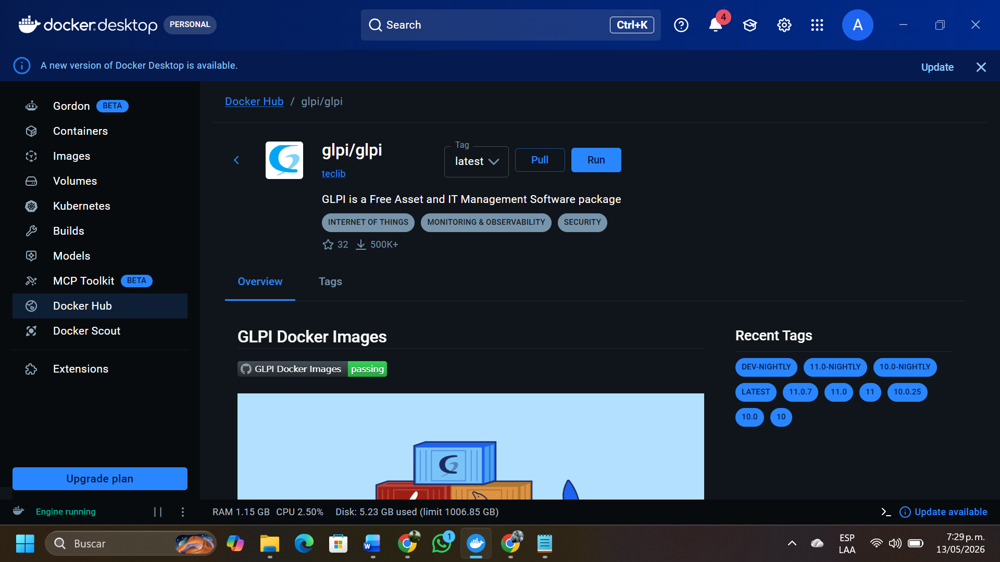
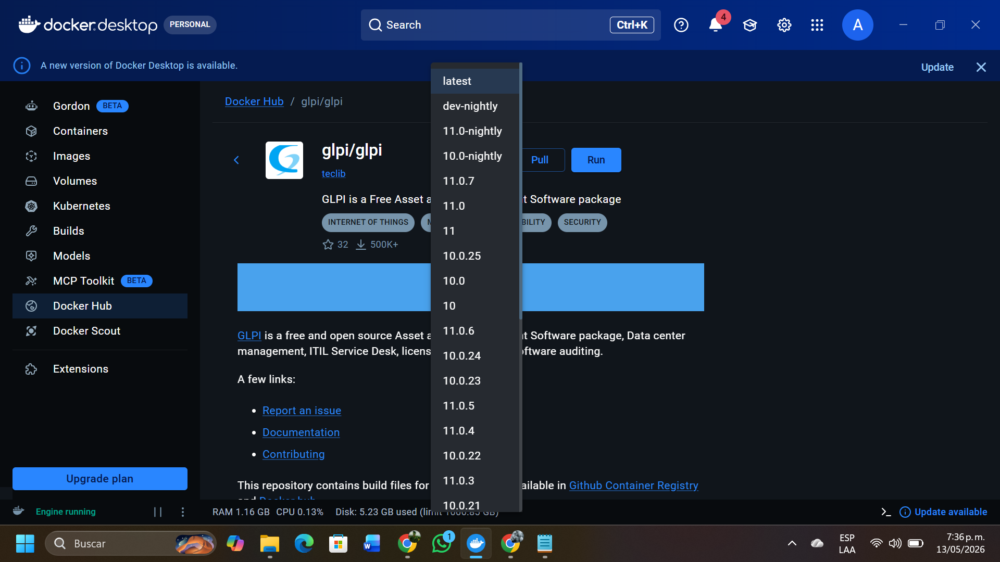
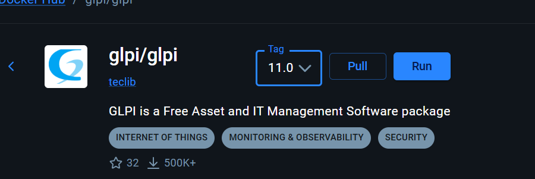
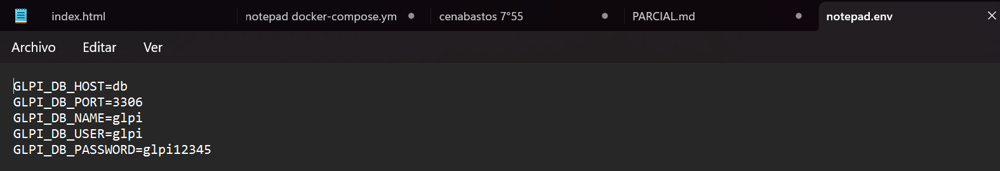
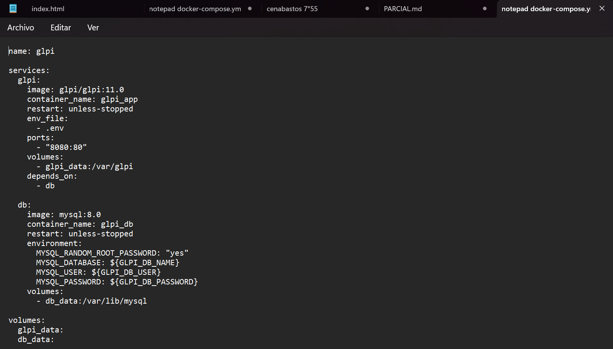
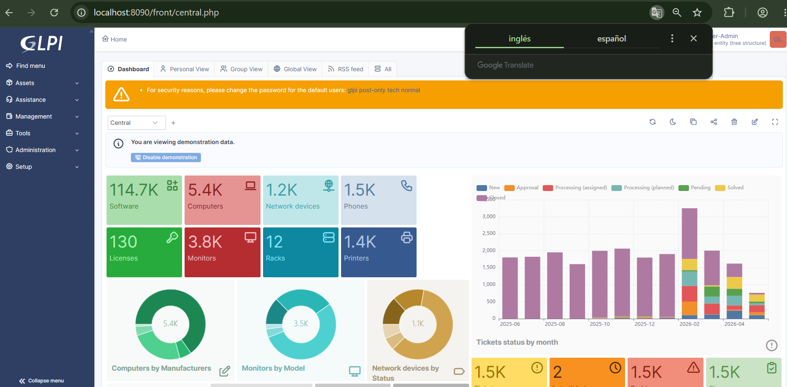
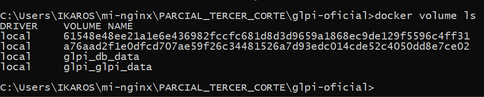
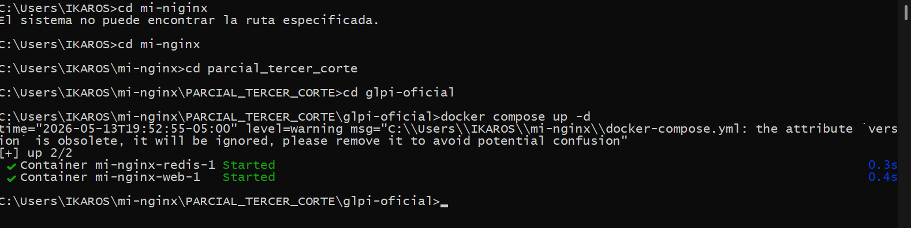
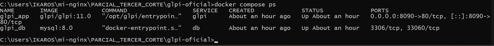

# Despliegue de GLPI desde Repositorio Oficial

## Nota Parcial 3er Corte

**Tema:** Despliegue de GLPI desde repositorio oficial usando Docker Compose  
**Autor:** Andrés Moreno  
**Repositorio local:** `C:\Users\IKAROS\mi-nginx\PARCIAL_TERCER_CORTE`  
**Carpeta del proyecto:** `C:\Users\IKAROS\mi-nginx\PARCIAL_TERCER_CORTE\glpi-oficial`

---

# 1. Introducción

El presente ejercicio tiene como finalidad desplegar una instancia funcional de GLPI utilizando Docker Compose, aplicando principios de infraestructura como código, persistencia de datos y gestión de variables de entorno. El despliegue integra un contenedor para la aplicación GLPI y un contenedor adicional para la base de datos MySQL, permitiendo que ambos servicios se comuniquen mediante la red interna creada automáticamente por Docker Compose.

---

# Fase I: Análisis del Repositorio

## 1.1 Localizar el repositorio oficial de GLPI en Docker Hub o GitHub

Para iniciar el proceso se consultó la imagen oficial de GLPI en Docker Hub y el repositorio oficial del proyecto en GitHub. Esta revisión permite confirmar que se está utilizando una imagen confiable y mantenida por el proyecto GLPI.

**Imagen que debes pegar aquí:**  


**Imagen opcional que puedes pegar aquí:**  




---

## 1.2 Identificar las etiquetas disponibles para seleccionar la versión más estable

En Docker Hub se revisaron las etiquetas disponibles de la imagen `glpi/glpi`. Para evitar problemas de actualización automática, se recomienda utilizar una versión específica o una rama estable, por ejemplo:

```yaml
image: glpi/glpi:11.0
```

El uso de una etiqueta específica garantiza mayor control sobre la versión desplegada y facilita la reproducción del entorno en otros equipos.

**Imagen que debes pegar aquí:**  



---

## 1.3 Analizar las variables de entorno obligatorias

Las variables de entorno permiten que GLPI se conecte con la base de datos sin escribir directamente las credenciales dentro del código principal. Estas variables fueron definidas en el archivo `.env`.

```env
GLPI_DB_HOST=db
GLPI_DB_PORT=3306
GLPI_DB_NAME=glpi
GLPI_DB_USER=glpi
GLPI_DB_PASSWORD=glpi12345
```

| Variable | Función |
|---|---|
| `GLPI_DB_HOST` | Nombre del servicio de base de datos dentro de Docker Compose. |
| `GLPI_DB_PORT` | Puerto interno de conexión de MySQL. |
| `GLPI_DB_NAME` | Nombre de la base de datos utilizada por GLPI. |
| `GLPI_DB_USER` | Usuario autorizado para acceder a la base de datos. |
| `GLPI_DB_PASSWORD` | Contraseña del usuario de base de datos. |

El valor más importante es:

```env
GLPI_DB_HOST=db
```

Esto significa que GLPI no se conecta a `localhost`, sino al servicio llamado `db`, definido dentro del archivo `docker-compose.yml`.

**Imagen que debes pegar aquí:**  


---

# Fase II: Despliegue de la Infraestructura

## 2.1 Definición de servicios

El entorno fue definido mediante Docker Compose, creando dos servicios principales:

| Servicio | Función |
|---|---|
| `glpi` | Contenedor de la aplicación web GLPI. |
| `db` | Contenedor de base de datos MySQL. |

Fragmento principal del archivo `docker-compose.yml`:

```yaml
services:
  glpi:
    image: glpi/glpi:11.0
    container_name: glpi_app
    restart: unless-stopped
    env_file:
      - .env
    ports:
      - "8090:80"
    volumes:
      - glpi_data:/var/glpi
    depends_on:
      - db

  db:
    image: mysql:8.0
    container_name: glpi_db
    restart: unless-stopped
    environment:
      MYSQL_RANDOM_ROOT_PASSWORD: "yes"
      MYSQL_DATABASE: ${GLPI_DB_NAME}
      MYSQL_USER: ${GLPI_DB_USER}
      MYSQL_PASSWORD: ${GLPI_DB_PASSWORD}
    volumes:
      - db_data:/var/lib/mysql
```

**Imagen que debes pegar aquí:**  



---

## 2.2 Mapeo de puertos

El contenedor de GLPI trabaja internamente sobre el puerto `80`. Para evitar conflictos con otros servicios del sistema, se utilizó el puerto local `8090`.

```yaml
ports:
  - "8090:80"
```

Esto significa:

| Puerto local del PC | Puerto interno del contenedor |
|---|---|
| `8090` | `80` |

Por lo tanto, el acceso a GLPI se realiza desde el navegador mediante:

```text
http://localhost:8090
```

**Imagen que debes pegar aquí:**  


---

## 2.3 Persistencia de datos

La persistencia se configuró mediante volúmenes Docker, evitando que la información se pierda al detener o recrear los contenedores.

```yaml
volumes:
  - glpi_data:/var/glpi
```

```yaml
volumes:
  - db_data:/var/lib/mysql
```

| Volumen | Ruta interna | Función |
|---|---|---|
| `glpi_data` | `/var/glpi` | Guarda archivos persistentes de GLPI. |
| `db_data` | `/var/lib/mysql` | Guarda datos internos de MySQL. |

**Imagen que debes pegar aquí:**  



Para verificar la creación de los volúmenes se utilizó:

```bash
docker volume ls
```

**Imagen que debes pegar aquí:**  


---

# Fase III: Despliegue y Validación

## 3.1 Ejecutar la descarga de imágenes y levantamiento de servicios

Desde la carpeta del proyecto:

```text
C:\Users\IKAROS\mi-nginx\PARCIAL_TERCER_CORTE\glpi-oficial
```

se ejecutó el siguiente comando:

```bash
docker compose up -d
```

Este comando descarga las imágenes necesarias y levanta los servicios en segundo plano.

**Imagen que debes pegar aquí:**  



---

## 3.2 Verificar contenedores activos

Para confirmar que los contenedores quedaron corriendo se ejecutó:

```bash
docker compose ps
```

El resultado debe mostrar los servicios:

```text
glpi_app
glpi_db
```

**Imagen que debes pegar aquí:**  



---

## 3.3 Vinculación inicial con la base de datos

La conexión entre GLPI y MySQL se realizó mediante el nombre del servicio de base de datos definido en Docker Compose:

```text
db
```

Los datos de conexión definidos fueron:

```text
Servidor SQL: db
Usuario SQL: glpi
Contraseña SQL: glpi12345
Base de datos: glpi
```

No se utiliza `localhost`, porque dentro de la red de Docker Compose el contenedor de GLPI identifica al contenedor de MySQL mediante el nombre del servicio `db`.

**Imagen que debes pegar aquí si GLPI entró directamente al login:**  


---

## 3.4 Validación de la base de datos

Para validar que la base de datos `glpi` existe dentro del contenedor MySQL, se puede ejecutar:

```bash
docker exec -it glpi_db mysql -u glpi -p
```

Luego se ingresa la contraseña:

```text
glpi12345
```

Y dentro de MySQL se ejecuta:

```sql
SHOW DATABASES;
```

Debe aparecer la base de datos:

```text
glpi
```

**Imagen que debes pegar aquí:**  


---

## 3.5 Validación desde la interfaz web

Finalmente, se accedió a la interfaz gráfica desde el navegador:

```text
http://localhost:8090
```

El ingreso correcto a la interfaz confirma que el despliegue fue exitoso.

**Imagen que debes pegar aquí:**  


---

# Conclusiones

El despliegue de GLPI mediante Docker Compose permitió crear un entorno funcional, reproducible y organizado bajo el enfoque de infraestructura como código. La práctica integró una aplicación web y una base de datos MySQL comunicadas mediante una red interna de Docker.

El uso de variables de entorno permitió separar las credenciales del archivo principal de configuración, mejorando la seguridad del despliegue. Asimismo, la implementación de volúmenes garantizó la persistencia de los datos, evitando la pérdida de información al detener o reiniciar los contenedores.

Finalmente, la validación mediante consola y navegador confirmó que GLPI reconoció correctamente el servicio de base de datos llamado `db`, utilizando la base de datos `glpi` y permitiendo el acceso funcional desde `http://localhost:8090`.

---

# Anexos: comandos utilizados

```bash
cd /d C:\Users\IKAROS\mi-nginx\PARCIAL_TERCER_CORTE\glpi-oficial
docker compose up -d
docker compose ps
docker volume ls
docker network ls
docker network inspect glpi_default
docker exec -it glpi_db mysql -u glpi -p
```

---

# Ubicación sugerida de imágenes

Crear la carpeta:

```text
C:\Users\IKAROS\mi-nginx\PARCIAL_TERCER_CORTE\imagenes
```

Guardar las capturas con estos nombres:

```text
Localizacion_GLPI.png
Tags.png
Tag elegido.png
Variables.png
Creacion yml servicios.png
Ingreso GLPI localhost.png
Creacion de volumenes.png
Descargar imagenes y levantar servicios.png
Docker compose ps.png
reconoce base datos glpi en myqsl.png
```
