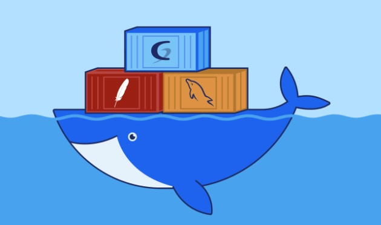

### Despliegue de GLPI desde Repositorio Oficial (GLPI)

#### 1. Introducción y Contexto

El objetivo es desplegar una instancia funcional de GLPI utilizando únicamente las definiciones del repositorio oficial. Se requiere un enfoque de **infraestructura como código** (IaC) para garantizar que el servicio sea reproducible y seguro.

#### 2. Objetivos de la Práctica

* **Investigación Técnica:** Interpretar los archivos de configuración (`docker-compose`, `Dockerfile` o `env`) directamente desde la fuente oficial.
* **Orquestación Local:** Configurar un entorno de contenedores que garantice la persistencia de la base de datos y los archivos de configuración.
* **Gestión de Secretos:** Implementar el uso de variables de entorno para evitar la exposición de credenciales.

---

### 3. Guía de Ejecución (Paso a Paso)

**Fase I: Análisis del Repositorio**

1. Localizar el repositorio oficial de GLPI en Docker Hub o GitHub.
2. Identificar las **etiquetas (tags)** disponibles para seleccionar la versión más estable.
3. Analizar las **variables de entorno obligatorias** requeridas por la imagen para conectarse a una base de datos (host, usuario, password y nombre de la BD).

**Fase II: Despliegue de la Infraestructura**

1. **Definición de Servicios:** Crear un diseño donde coexistan el contenedor de aplicación y el de base de datos (MariaDB o MySQL).
2. **Mapeo de Puertos:** Establecer un puerto local que no entre en conflicto con otros servicios del sistema.
3. **Persistencia:** Investigar las rutas internas de la imagen oficial (usualmente bajo `/var/lib/...`) para montar volúmenes locales y evitar la pérdida de datos al detener los contenedores.

**Fase III: Despliegue y Validación**

1. Ejecutar la descarga de imágenes y el levantamiento de servicios.
2. Realizar la vinculación inicial a través de la interfaz web, asegurando que la aplicación "vea" al contenedor de la base de datos por su nombre de servicio en la red de Docker.

**Fase IV**

- Documentar paso a paso  en github.
- Crear imágenes en Dockerhub con sus respectivos Overview.

---

* **Entrega**
- Crear una carpeta por grupo dentro de esta y en ella crear el README con imágenes del desarrollo. 

