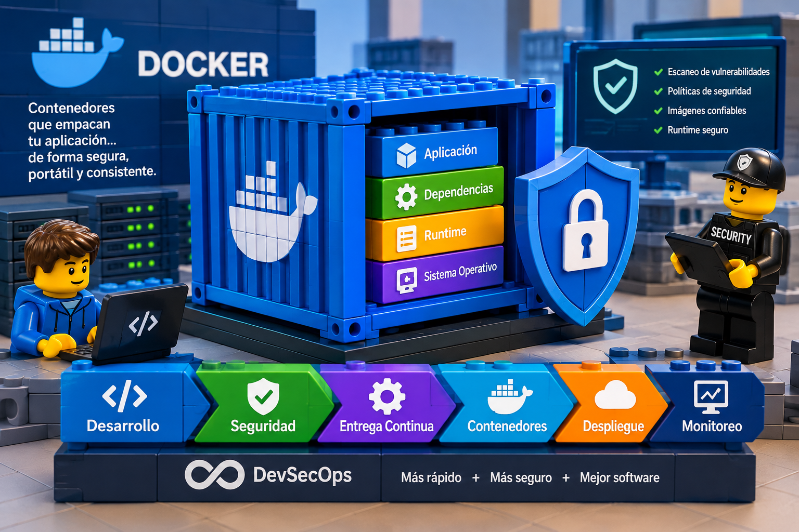

# CONTENEDORES

**Contenerización.**

La contenerización es una tecnología que permite empaquetar una aplicación junto con todas sus dependencias (como bibliotecas, configuraciones y archivos necesarios) en una unidad estandarizada llamada contenedor. Este contenedor es una entidad aislada que se ejecuta sobre el sistema operativo del host, proporcionando un entorno consistente para la aplicación, independientemente del lugar donde se despliegue.

## Principales características de la contenerización:

* **Aislamiento de entornos:** Cada contenedor opera de forma independiente y aislada de otros contenedores y del sistema operativo host. Los procesos dentro de un contenedor no interfieren con los de otro.
* **Portabilidad:** Los contenedores pueden ejecutarse en cualquier sistema que disponga de un motor compatible (como Docker Engine), facilitando el traslado de aplicaciones entre entornos de desarrollo, pruebas y producción sin modificar el código.
* **Ligereza y eficiencia:** A diferencia de las máquinas virtuales, los contenedores comparten el núcleo del sistema operativo del host, lo que reduce el consumo de recursos y permite ejecutar múltiples contenedores en un solo servidor de manera eficiente.
* **Escalabilidad:** Se logra escalar con facilidad las aplicaciones basadas en contenedores, ya que es posible replicar y administrar múltiples instancias para gestionar cargas de trabajo variables.

# Beneficios de la contenerización:

* **Consistencia en el despliegue:** Al empaquetar todas las dependencias, se asegura que la aplicación se comporte de la misma manera en diferentes entornos, eliminando el clásico problema de «funciona en mi máquina».
* **Rapidez en el inicio y despliegue:** Los contenedores se inician en segundos, lo que acelera el ciclo de desarrollo y despliegue de las aplicaciones.
* **Mejor utilización de recursos:** Al ser más ligeros que las máquinas virtuales, permiten una mayor densidad de aplicaciones sobre el mismo hardware.
* **Facilidad de integración y entrega continua (CI/CD):** Los contenedores se integran adecuadamente con herramientas de automatización, facilitando la adopción de prácticas DevOps.

# Herramientas y tecnologías relacionadas:

* **Docker:** Es la plataforma más popular para crear, desplegar y ejecutar contenedores. Proporciona un conjunto de herramientas y comandos para operar contenedores de forma sencilla.
* **Kubernetes:** Es un sistema de orquestación de contenedores que automatiza el despliegue, escalado y gestión de aplicaciones contenerizadas en un clúster de servidores.
* **Docker Compose:** Permite definir y ejecutar aplicaciones compuestas por múltiples contenedores Docker mediante un archivo YAML para configurar los servicios.

**Ejemplo práctico:**

Considérese el caso en que un equipo de desarrollo crea una aplicación web que requiere una versión específica de Node.js y ciertas dependencias. Sin contenerización, el equipo tendría que configurar cada servidor de destino con las mismas versiones y dependencias exactas, un proceso propenso a errores que demanda tiempo considerable.

Con contenerización:

* Se genera una imagen de Docker que incluye la aplicación y todas sus dependencias.
* Se empaqueta la solución en un contenedor, garantizando su ejecución en el entorno requerido.
* Se despliega el contenedor en cualquier servidor con Docker instalado, sin necesidad de intervenir en las configuraciones subyacentes del host.

Este método asegura que la aplicación funcione de manera consistente en cualquier infraestructura, simplificando el proceso de despliegue y minimizando incidencias derivadas de configuraciones dispares.

# Referencias.

- https://www.datacamp.com/es/tutorial/docker-tutorial
- https://www.docker.com/
- https://dockerlabs.collabnix.com/docker-workshop/lab1/postgres
