# CentOS Stream 10 + Zabbix 7.4

[](https://www.centos.org/stream/)
[](https://www.zabbix.com/)
[](https://www.virtualbox.org/)
[](#alcance-y-privacidad)

## Laboratorio de instalación, monitoreo y alertas

Este proyecto presenta una ruta reproducible para instalar **CentOS Stream 10** en una máquina virtual, desplegar **Zabbix 7.4** con MariaDB/MySQL y Apache, conectar un equipo físico mediante el agente Zabbix y enviar alertas técnicas por correo electrónico.

> **Objetivo del laboratorio:** observar la disponibilidad, el rendimiento y los eventos técnicos de equipos autorizados, y notificar los problemas relevantes a un buzón operativo.

> **Importante:**  Este procedimiento no incluye keylogging, captura encubierta de pantalla, lectura de archivos privados, interceptación de comunicaciones ni vigilancia secreta.

## Recorrido rápido

| Fase | Resultado |
|---|---|
| 01 · Preparar | VM con CentOS Stream 10 y red accesible |
| 02 · Instalar | Zabbix Server, base de datos y frontend web |
| 03 · Conectar | Equipo físico registrado mediante el agente |
| 04 · Alertar | Medio Email, acción y prueba controlada |
| 05 · Operar | Monitoreo técnico, seguro y documentado |


## Arquitectura

```text
┌──────────────────────────┐       LAN       ┌────────────────────────────────┐
│ Equipo físico autorizado │ ──────────────> │ VM CentOS Stream 10            │
│                          │                │ Zabbix Server 7.4              │
│ Zabbix Agent             │                │ MariaDB/MySQL + Apache          │
│ CPU · RAM · disco        │                │ Panel web: /zabbix              │
│ servicios autorizados    │                └───────────────┬────────────────┘
└──────────────────────────┘                                │
                                                            │ SMTP seguro
                                                            v
                                                   ┌────────────────────┐
                                                   │ Buzón de alertas   │
                                                   └────────────────────┘
```

Para este laboratorio se recomienda configurar la VM con **adaptador puente**. Así, la máquina virtual obtiene una dirección propia en la red autorizada y puede comunicarse directamente con el equipo físico. VirtualBox documenta que NAT permite la salida de la VM, pero mantiene la máquina aislada de conexiones entrantes salvo que se configure redirección de puertos.

## Requisitos sugeridos

| Componente | Valor de laboratorio |
|---|---:|
| CPU de la VM | 2 vCPU |
| Memoria | 4 GiB |
| Disco | 30–40 GiB dinámicos |
| Sistema | CentOS Stream 10 x86_64 |
| Red | Adaptador puente o segmento de laboratorio |
| Base de datos | MariaDB/MySQL |
| Frontend | Apache + PHP |
| Correo | Cuenta técnica autorizada |

## 1. Preparar e instalar la máquina virtual

Descarga la ISO de CentOS Stream 10 desde una fuente oficial y verifica su integridad antes de utilizarla [2]. En Linux:

```bash
sha256sum CentOS-Stream-10-*.iso
```

En Windows PowerShell:

```powershell
Get-FileHash .\CentOS-Stream-10-*.iso -Algorithm SHA256
```

En VirtualBox selecciona **Nueva**, asigna 2 vCPU, 4 GiB de RAM y un disco dinámico de 30–40 GiB. En **Configuración → Red → Adaptador 1**, activa **Adaptador puente** y selecciona la interfaz conectada a la LAN autorizada.

Inicia la ISO, selecciona **Install CentOS Stream 10**, configura el disco, la zona horaria y una cuenta administrativa. Utiliza un nombre como `zabbix-server`. La secuencia visual de preparación e instalación se resume en la siguiente captura del material de apoyo:

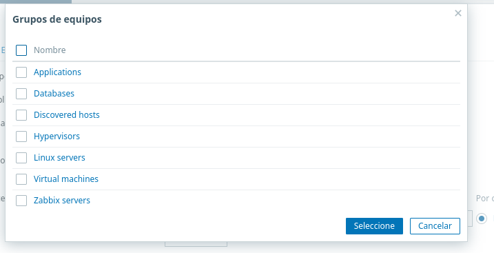

Después del primer inicio, actualiza el sistema, establece el nombre de host y registra la dirección de red:

```bash
sudo dnf update -y
sudo hostnamectl set-hostname zabbix-server
hostnamectl
ip -br address
ip route
cat /etc/centos-release
```

Anota la IP de la VM como `ZABBIX_SERVER_IP`. Utiliza una IP reservada por el administrador de red o una concesión DHCP estable.

## 2. Instalar Zabbix Server

### 2.1 Paquetes base y repositorio

Instala MariaDB, Apache, PHP y las extensiones requeridas. Después agrega el repositorio oficial de Zabbix 7.4 e instala el servidor, el frontend, los scripts SQL, la política SELinux y el agente local [3] [4].

```bash
sudo dnf install -y mariadb-server httpd php php-fpm php-mysqlnd \
  php-gd php-xml php-bcmath php-mbstring php-ldap php-json php-opcache
sudo systemctl enable --now mariadb httpd php-fpm

sudo rpm -Uvh https://repo.zabbix.com/zabbix/7.4/release/centos/10/noarch/zabbix-release-latest-7.4.el10.noarch.rpm
sudo dnf clean all
sudo dnf install -y zabbix-server-mysql zabbix-web-mysql \
  zabbix-apache-conf zabbix-sql-scripts zabbix-selinux-policy zabbix-agent
```

Comprueba los paquetes instalados y el estado inicial de los servicios:

```bash
rpm -q zabbix-server-mysql zabbix-web-mysql zabbix-agent mariadb-server
sudo systemctl --no-pager --full status mariadb httpd php-fpm
```

La captura siguiente sirve como referencia visual para la preparación del repositorio y la instalación de los paquetes:

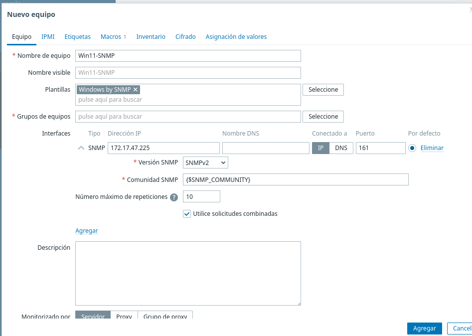

Una vez instalados los componentes, valida que el sistema reconoce los paquetes y que los servicios base se encuentran disponibles:

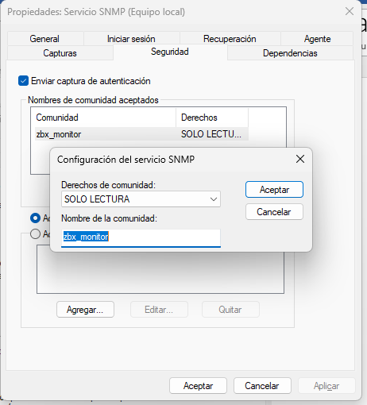

### 2.2 Crear la base de datos

Ejecuta `sudo mariadb` y crea una base de datos y un usuario dedicado. Sustituye el marcador por un secreto largo que no se publique en GitHub:

```sql
CREATE DATABASE zabbix CHARACTER SET utf8mb4 COLLATE utf8mb4_bin;
CREATE USER 'zabbix'@'localhost' IDENTIFIED BY 'CAMBIAR_POR_UN_SECRETO_LARGO';
GRANT ALL PRIVILEGES ON zabbix.* TO 'zabbix'@'localhost';
SET GLOBAL log_bin_trust_function_creators = 1;
FLUSH PRIVILEGES;
EXIT;
```

Importa el esquema inicial y desactiva después el ajuste temporal:

```bash
zcat /usr/share/zabbix/sql-scripts/mysql/server.sql.gz \
  | mysql --default-character-set=utf8mb4 -uzabbix -p zabbix

sudo mariadb -e "SET GLOBAL log_bin_trust_function_creators = 0;"
```

La secuencia de creación e inicialización de la base de datos puede contrastarse con estas capturas de apoyo:

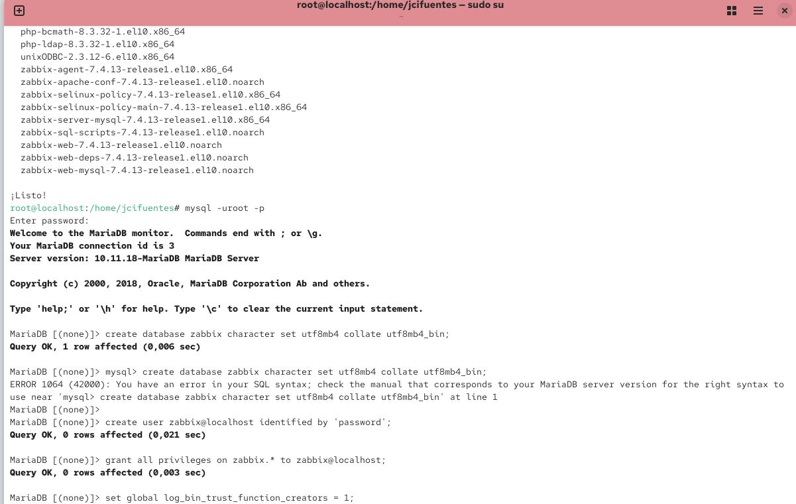

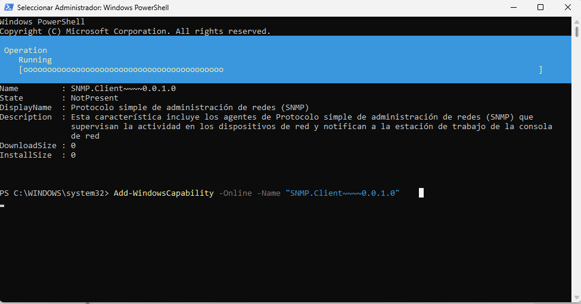

Edita `/etc/zabbix/zabbix_server.conf`:

```ini
DBName=zabbix
DBUser=zabbix
DBPassword=CAMBIAR_POR_UN_SECRETO_LARGO
```

Protege el archivo de configuración y evita publicarlo:

```bash
sudo chown root:zabbix /etc/zabbix/zabbix_server.conf
sudo chmod 640 /etc/zabbix/zabbix_server.conf
```

### 2.3 Firewall, SELinux y servicios

No desactives SELinux como solución general. Comprueba su estado y revisa los rechazos recientes antes de realizar ajustes:

```bash
getenforce
sudo ausearch -m AVC -ts recent 2>/dev/null | tail -n 20 || true
```

En un laboratorio con comprobaciones activas desde el equipo físico, abre únicamente HTTP y el puerto del servidor Zabbix:

```bash
sudo firewall-cmd --permanent --add-service=http
sudo firewall-cmd --permanent --add-port=10051/tcp
sudo firewall-cmd --reload
sudo firewall-cmd --list-all
```

Activa los servicios y comprueba los puertos:

```bash
sudo systemctl enable --now zabbix-server zabbix-agent httpd php-fpm
sudo systemctl --no-pager --full status zabbix-server zabbix-agent httpd php-fpm
sudo ss -lntp | grep -E ':80|:10051|:10050' || true
```

## 3. Configurar el frontend web

Abre `http://ZABBIX_SERVER_IP/zabbix` y completa el asistente con la base de datos creada:

| Campo | Valor |
|---|---|
| Database type | MySQL |
| Database host | `localhost` |
| Database name | `zabbix` |
| User | `zabbix` |
| Password | La contraseña de la base |
| Zabbix server name | Un nombre descriptivo, por ejemplo `Global` |
| Time zone | La misma configurada en CentOS |

La pantalla de requisitos previos del frontend permite confirmar que Apache, PHP y los módulos necesarios están disponibles:


En la pantalla de base de datos introduce el host, el nombre de la base, el usuario y la contraseña definidos anteriormente. No reutilices el usuario `root` para la conexión de Zabbix:


A continuación define el nombre visible del servidor y la zona horaria. Mantener una zona horaria coherente facilita la interpretación de históricos y eventos:

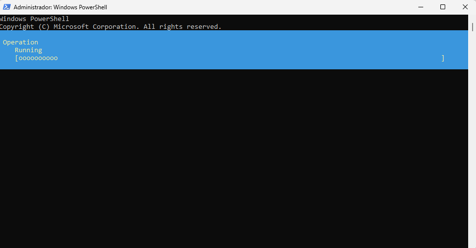

Revisa el resumen antes de finalizar. Comprueba especialmente el tipo de base de datos, el nombre del servidor y la zona horaria:

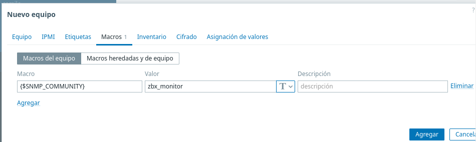

Al terminar, el asistente confirma la instalación y permite acceder al panel:

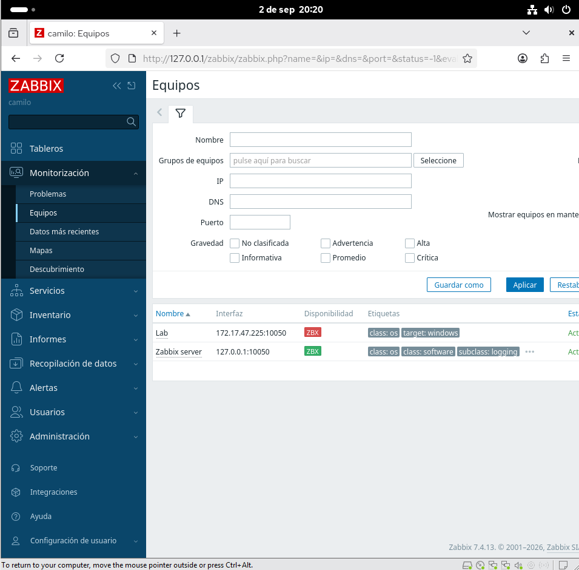

El panel inicial sirve como evidencia visual de que el frontend quedó operativo:

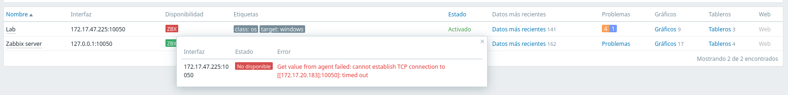

## 4. Conectar el equipo físico

La documentación de Zabbix define los parámetros `Hostname`, `Server` y `ServerActive` del agente UNIX [5]. El valor de `Hostname` debe coincidir exactamente con el nombre del host creado en la interfaz web.

### 4.1 Modalidad activa, recomendada para comenzar

En el equipo físico autorizado instala el agente oficial correspondiente a su sistema operativo. Para otro CentOS Stream 10, el ejemplo es:

```bash
sudo rpm -Uvh https://repo.zabbix.com/zabbix/7.4/release/centos/10/noarch/zabbix-release-latest-7.4.el10.noarch.rpm
sudo dnf clean all
sudo dnf install -y zabbix-agent
```

Edita `/etc/zabbix/zabbix_agentd.conf`:

```ini
Server=ZABBIX_SERVER_IP
ServerActive=ZABBIX_SERVER_IP:10051
Hostname=MONITORED_HOST_NAME
```

Activa el agente y revisa sus registros:

```bash
sudo systemctl enable --now zabbix-agent
sudo systemctl --no-pager --full status zabbix-agent
sudo journalctl -u zabbix-agent -b --no-pager -n 50
```

Desde el equipo físico prueba la salida hacia la VM:

```bash
nc -vz ZABBIX_SERVER_IP 10051
```

### 4.2 Modalidad pasiva

En la modalidad pasiva el servidor consulta al agente por `TCP/10050`:

```ini
Server=ZABBIX_SERVER_IP
ServerActive=ZABBIX_SERVER_IP:10051
Hostname=MONITORED_HOST_NAME
ListenPort=10050
```

Si el equipo físico usa `firewalld`, permite el acceso únicamente desde la IP del servidor:

```bash
sudo firewall-cmd --permanent \
  --add-rich-rule='rule family="ipv4" source address="ZABBIX_SERVER_IP/32" port port="10050" protocol="tcp" accept'
sudo firewall-cmd --reload
```

Desde la VM prueba la conexión:

```bash
nc -vz MONITORED_HOST_IP 10050
```

### 4.3 Registrar el host en Zabbix

En la interfaz web selecciona **Data collection → Hosts → Create host** y utiliza los siguientes valores:

| Campo | Ejemplo |
|---|---|
| Host name | `equipo-fisico-01` |
| Host groups | `Laboratorio autorizado` |
| Interface | Zabbix agent |
| IP | `MONITORED_HOST_IP` |
| Port | `10050` |
| Template | `Linux by Zabbix agent` o la plantilla del sistema |

Zabbix documenta `10050/TCP` para el agente, `10051/TCP` para el servidor, proxy o trapper, `80/TCP` para HTTP y `443/TCP` para HTTPS [8]. En redes no confiables, configura TLS con certificados o PSK y nunca publiques la clave en el repositorio [9].

## 5. Configurar alertas por correo

Zabbix utiliza un **medio** para entregar el correo y una **acción** para decidir cuándo enviarlo [6] [7].

1. Entra en **Alerts → Media types** y crea o edita el tipo **Email**.
2. Selecciona `Generic SMTP` o el proveedor recomendado.
3. Configura el servidor, puerto, remitente, seguridad de conexión y autenticación.
4. Utiliza OAuth, un relay SMTP o una contraseña de aplicación conforme a la política del proveedor.
5. En **Users → Users**, asigna el medio a un usuario o grupo autorizado y define `ALERT_EMAIL` como destinatario.
6. En **Alerts → Actions → Trigger actions**, crea una acción con condiciones como `Host group = Laboratorio autorizado` y `Trigger severity >= Warning`.
7. Añade la operación **Send message** al medio Email y habilita el mensaje de recuperación.

La configuración del proveedor debe realizarse sin publicar credenciales. La captura de apoyo muestra el flujo de generación de una contraseña de aplicación; el valor visible fue redactado antes de incorporarlo al repositorio:


La cuenta de aplicación y sus datos identificables también deben sustituirse por valores de ejemplo antes de compartir el material:

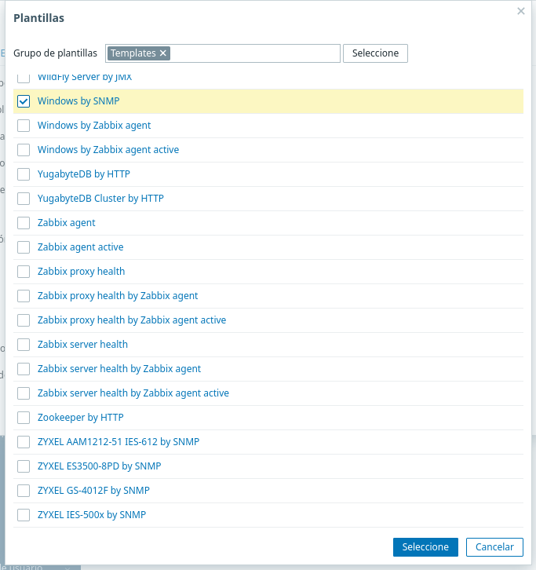

Para probar el medio, ve a **Alerts → Media types → Email → Test**, introduce un destinatario autorizado, asunto y mensaje, y pulsa **Test**. La documentación oficial describe esta prueba [6].

Un mensaje técnico y mínimo puede utilizar las siguientes macros:

```text
Asunto: [Zabbix][{TRIGGER.SEVERITY}] {HOST.NAME}: {TRIGGER.NAME}

Se detectó un evento técnico en un equipo autorizado.
Host: {HOST.NAME}
Problema: {TRIGGER.NAME}
Severidad: {TRIGGER.SEVERITY}
Estado: {TRIGGER.STATUS}
Hora: {EVENT.DATE} {EVENT.TIME}
Evento: {EVENT.ID}
```

La evidencia de recepción debe revisarse eliminando direcciones personales y cualquier secreto antes de publicarla:

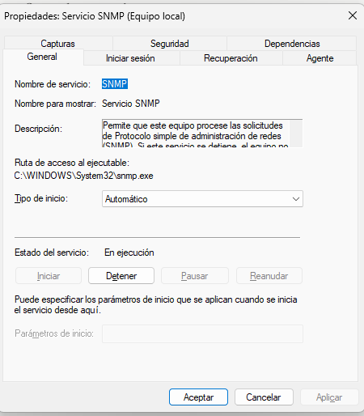

Finalmente, la prueba del tipo de medio debe mostrar un envío exitoso al buzón autorizado:

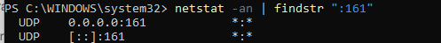

## 6. Alertas de tamaño de carpetas, tarjeta de red y Telegram

Esta sección se agrega a la secuencia existente. Los controles son determinísticos: el agente calcula el tamaño de carpetas autorizadas y consulta el estado operativo de interfaces Linux; Zabbix evalúa los umbrales y entrega las notificaciones por correo y Telegram. Zabbix 7.4 documenta la clave nativa `vfs.dir.size` para tamaños de directorios y `net.if.discovery` para descubrir interfaces [10] [11]. Para mantener un comportamiento explícito y portable en este laboratorio se incorporan dos `UserParameter` pequeños y auditables.

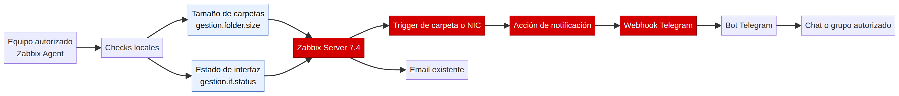

### 6.1 Copiar e instalar los checks en el equipo monitoreado

Desde el equipo autorizado, copia la carpeta `monitoring/zabbix-agent` de este repositorio. No copies tokens ni contraseñas al repositorio. Ejecuta:

```bash
cd monitoring/zabbix-agent
sudo ./install.sh
```

El instalador coloca los scripts en `/usr/local/libexec/zabbix`, registra los parámetros en `/etc/zabbix/zabbix_agentd.d/gestion-red.conf`, aplica permisos restrictivos y reinicia el agente. Comprueba que los checks respondan:

```bash
sudo zabbix_agentd -t 'gestion.folder.size[/var/log]'
sudo zabbix_agentd -t 'gestion.if.status[eth0]'
```

Sustituye `eth0` por la interfaz real obtenida con `ip -br link`. El check de interfaz devuelve `1` cuando el estado operativo es `up` o `unknown`, y `0` cuando está `down`, `dormant`, `lowerlayerdown` o no existe. La interfaz `unknown` puede ser normal para `lo`; para una tarjeta física utiliza el nombre mostrado por `ip -br link`.

Si una carpeta no es legible por el usuario `zabbix`, concede únicamente el acceso mínimo al árbol autorizado. Por ejemplo, para una carpeta operativa específica:

```bash
sudo setfacl -m u:zabbix:rx /ruta
sudo setfacl -R -m u:zabbix:rx /ruta/carpeta-monitoreada
```

No otorgues permisos amplios sobre `/home`, directorios privados ni árboles que no formen parte del objetivo autorizado.

Los archivos agregados para esta fase son:

| Archivo | Propósito |
|---|---|
| `monitoring/zabbix-agent/dir_size.sh` | Devuelve el tamaño de una carpeta en bytes y valida que la ruta sea absoluta. |
| `monitoring/zabbix-agent/iface_status.sh` | Devuelve el estado operativo de una interfaz Linux como `1`, `0` o `2`. |
| `monitoring/zabbix-agent/gestion-red.conf` | Registra las claves `gestion.folder.size[*]` y `gestion.if.status[*]`. |
| `monitoring/zabbix-agent/install.sh` | Instala los archivos con permisos restrictivos y reinicia el agente. |
| `monitoring/zabbix-server/media_telegram.yaml` | Definición oficial del medio webhook de Telegram para importar en Zabbix 7.4. |

### 6.2 Crear los ítems en Zabbix

En **Data collection → Hosts → equipo-fisico-01 → Items**, crea un ítem por cada carpeta y por cada tarjeta que deban monitorearse. Usa tipo **Zabbix agent (active)** si el host trabaja en modalidad activa; si se configuró la modalidad pasiva, usa **Zabbix agent**. El tipo de dato de ambos checks es **Numeric (unsigned)**.

| Nombre sugerido | Key | Intervalo | Unidad |
|---|---|---:|---|
| Tamaño de `/var/log` | `gestion.folder.size[/var/log]` | `5m` | `B` |
| Estado de `eth0` | `gestion.if.status[eth0]` | `1m` | — |

Para varias carpetas, crea ítems separados, por ejemplo `gestion.folder.size[/var/lib/mysql]` o `gestion.folder.size[/opt/app-demo]`. Usa únicamente rutas que hayan sido autorizadas y evita colocar secretos dentro de los nombres o parámetros.

### 6.3 Crear los triggers y umbrales

En el host define macros de usuario para que los límites puedan cambiarse desde la interfaz sin editar scripts:

| Macro | Ejemplo | Significado |
|---|---:|---|
| `{$FOLDER_VAR_LOG_LIMIT}` | `5368709120` | 5 GiB expresados en bytes. |
| `{$FOLDER_MYSQL_LIMIT}` | `10737418240` | 10 GiB expresados en bytes. |
| `{$IFACE_DOWN_FOR}` | `3m` | Tiempo continuo antes de alertar por una interfaz caída. |

Crea un trigger de carpeta con esta expresión, ajustando el nombre del host y la macro al ítem correspondiente:

```text
last(/equipo-fisico-01/gestion.folder.size[/var/log])>{$FOLDER_VAR_LOG_LIMIT}
```

Usa severidad **Warning** o **Average** según la política del laboratorio. Para la tarjeta de red, crea el siguiente trigger:

```text
min(/equipo-fisico-01/gestion.if.status[eth0],{$IFACE_DOWN_FOR})=0
```

El primer trigger avisa cuando la carpeta supera el límite; el segundo exige que el estado haya permanecido en `0` durante el periodo configurado. Activa **OK event generation** para recibir la recuperación cuando la carpeta vuelva a estar por debajo del umbral o la interfaz vuelva a estar operativa.

### 6.4 Configurar Telegram en Zabbix 7.4

Zabbix mantiene un medio oficial de tipo webhook para Telegram 7.4, con soporte para notificaciones personales y de grupos [12]. El procedimiento es el siguiente:

1. En Telegram abre `@BotFather`, envía `/newbot`, completa el asistente y guarda el token en un gestor de secretos. El token nunca debe publicarse en GitHub, capturas ni logs.
2. Para una notificación personal, obtén el chat ID mediante `@myidbot` siguiendo el procedimiento documentado por Zabbix y envía `/start` al bot nuevo. Para un grupo, agrega el bot y obtiene el ID del grupo; los grupos suelen usar un ID negativo.
3. En Zabbix entra en **Alerts → Media types → Import** e importa `monitoring/zabbix-server/media_telegram.yaml`.
4. Abre el medio **Telegram**, activa **Enabled**, configura `api_token` con el token del bot y selecciona `html` o `markdown` como `api_parse_mode`. No guardes el token en archivos del repositorio.
5. En **Users → Users**, abre el usuario operativo, selecciona **Media → Add**, elige **Telegram** y coloca el chat ID en **Send to**. Si se usa un tópico de supergrupo, utiliza el formato `-1001234567890:2`.
6. Crea una acción separada en **Alerts → Actions → Trigger actions**. Filtra por el grupo `Laboratorio autorizado` y por severidad igual o mayor que **Warning**. Agrega la operación **Send message** al medio Telegram y activa el mensaje de recuperación.
7. Mantén la acción de Email existente separada de la acción de Telegram. Así se conserva el formato de correo actual y se evitan etiquetas Markdown o HTML sin interpretar en otros medios.

Un mensaje recomendado para la acción es:

```text
<b>{EVENT.SEVERITY}</b> · {HOST.NAME}
Problema: {TRIGGER.NAME}
Estado: {TRIGGER.STATUS}
Hora: {EVENT.DATE} {EVENT.TIME}
Evento: {EVENT.ID}
```

La guía oficial de Zabbix identifica `api_token`, `api_parse_mode` y `{ALERT.SENDTO}` como parámetros del webhook [12]. En consecuencia, el token se configura únicamente en la interfaz de Zabbix y el destinatario queda asociado al medio del usuario.

### 6.5 Pruebas controladas

Primero prueba el medio sin generar una falla: entra en **Alerts → Media types → Telegram → Test**, selecciona un usuario o destinatario autorizado y confirma que el mensaje llega al chat. Después valida los checks desde el equipo monitoreado:

```bash
sudo zabbix_agentd -t 'gestion.folder.size[/var/log]'
sudo zabbix_agentd -t 'gestion.if.status[eth0]'
```

Para una prueba de carpeta, reduce temporalmente el valor de `{$FOLDER_VAR_LOG_LIMIT}` por debajo del dato observado; espera el intervalo de actualización, comprueba el problema en **Monitoring → Problems** y confirma Email y Telegram. Restaura el umbral original y verifica el evento de recuperación.

Para probar una tarjeta de red, utiliza únicamente una interfaz de laboratorio y una ventana acordada. Desconecta el enlace o deshabilita temporalmente la interfaz, verifica el evento y restáurala de inmediato:

```bash
sudo nmcli device disconnect eth0
sudo nmcli device connect eth0
```

No realices esta prueba sobre la interfaz que mantiene la sesión remota ni sobre equipos o servicios no autorizados. Revisa **Reports → Action log** para correlacionar el evento, la recuperación y el envío a Telegram.

### 6.6 Solución de problemas

| Síntoma | Comprobación |
|---|---|
| El ítem aparece como unsupported | Revisa `sudo journalctl -u zabbix-agent -n 100 --no-pager`, la ruta absoluta, los permisos del árbol y que `gestion-red.conf` esté en `zabbix_agentd.d`. |
| El tamaño devuelve error de permisos | Comprueba el acceso efectivo del usuario `zabbix` y aplica ACL mínima solo al directorio autorizado. |
| La interfaz no genera recuperación | Confirma que el key usa el nombre real de `ip -br link` y que el trigger no tenga un periodo excesivo. |
| Telegram no recibe mensajes | Usa **Test** del medio, verifica el token, el chat ID y que el usuario haya enviado `/start` al bot. |
| Telegram devuelve error de formato | Cambia `api_parse_mode` a `html` y usa etiquetas válidas; mantén la acción separada del Email. |
| Se filtró un token | Revoca el token en `@BotFather`, genera uno nuevo y revisa el historial del repositorio antes de compartirlo. |

## 7. Prueba controlada y operación responsable

Realiza la prueba únicamente sobre un equipo autorizado y un servicio de laboratorio no crítico. Detén el servicio durante un intervalo acordado, verifica que aparece el problema en Zabbix y comprueba la recepción del correo. Después restáuralo y confirma el mensaje de recuperación. Revisa **Reports → Action log** para correlacionar el evento y la notificación.

Ejemplos apropiados de alarmas técnicas son los siguientes:

| Evento | Mensaje operativo |
|---|---|
| Agente sin respuesta | El equipo físico no responde durante 5 minutos. |
| Disco lleno | El punto de montaje `/` supera 85 %. |
| Servicio detenido | `app-demo.service` está detenido. |
| Proceso autorizado ausente | El proceso `app-demo` no está ejecutándose. |

No utilices Zabbix para registrar actividades personales de forma encubierta. Si una organización necesita un control de cumplimiento, documenta el propósito, la autorización, las métricas recogidas, los permisos de acceso y el tiempo de retención.

## Alcance y privacidad

El monitoreo debe limitarse a métricas técnicas necesarias para el objetivo definido: disponibilidad, CPU, memoria, almacenamiento, estado de servicios y procesos expresamente autorizados. No deben recopilarse pulsaciones, contenido de archivos, capturas de pantalla, historial privado ni interpretaciones sobre la conducta de una persona.

Antes de publicar o compartir este repositorio, revisa que no contenga contraseñas de MariaDB, contraseñas de aplicación SMTP, tokens, claves TLS/PSK, archivos `.env`, logs ni direcciones privadas. Si una credencial del material original fue utilizada, revócala y genera una nueva.


## Referencias

 1.https://www.virtualbox.org/manual/ch06.html "Oracle VirtualBox User Manual — Virtual Networking"
 
 2.https://www.centos.org/download/ "The CentOS Project — Download"
 
 3.https://www.zabbix.com/download?zabbix=7.4&os_distribution=centos&os_version=10&components=server_frontend_agent&db=mysql&ws=apache "Zabbix — Download and install Zabbix 7.4 for CentOS 10"

 4.https://www.zabbix.com/documentation/7.4/en/manual/installation/install_from_packages "Zabbix 7.4 — Installation from packages"
 
 5.https://www.zabbix.com/documentation/7.4/en/manual/appendix/config/zabbix_agentd "Zabbix 7.4 — Zabbix agent (UNIX)"
 
 6.https://www.zabbix.com/documentation/7.4/en/manual/config/notifications/media/email "Zabbix 7.4 — Email media type"
 
 7.https://www.zabbix.com/documentation/7.4/en/manual/config/notifications "Zabbix 7.4 — Notifications upon events"
 
 8.https://www.zabbix.com/documentation/7.4/en/manual/installation/requirements "Zabbix 7.4 — Requirements and default ports"
 
 9.https://www.zabbix.com/documentation/7.4/en/manual/encryption "Zabbix 7.4 — Encryption"


10. https://www.zabbix.com/documentation/7.4/en/manual/config/items/itemtypes/zabbix_agent "Zabbix 7.4 — Zabbix agent item keys"

11. https://www.zabbix.com/documentation/7.4/en/manual/discovery/low_level_discovery/examples/network_interfaces "Zabbix 7.4 — Discovery of network interfaces"

12. https://www.zabbix.com/integrations/telegram "Zabbix — Telegram webhook integration"


---


# Monitorización autorizada de Windows 11 mediante SNMP con Zabbix

Procedimiento reproducible para incorporar Windows 11 24H2 a Zabbix 7.4 mediante SNMP v2c, sin instalar el agente nativo de Zabbix.

 ·  ·  · [Monitoreo autorizado](#alcance-y-privacidad) · [SNMP RFC 3416](https://www.rfc-editor.org/rfc/rfc3416)

> Laboratorio de monitorización técnica

Este proyecto presenta una ruta reproducible para observar la disponibilidad y el estado técnico de un equipo Windows 11 autorizado desde un servidor Zabbix. La recopilación se limita a métricas expuestas por SNMP, como identidad del sistema, tiempo activo, servicios SNMP e información de red disponible en los OID habilitados.

**Objetivo del laboratorio:** validar una integración SNMP documentada, restringida y auditable entre Windows 11 y Zabbix.


## Recorrido rápido

| Fase | Resultado |
|---|---|
| 01 · Preparar | Herramientas SNMP instaladas en el servidor |
| 02 · Instalar | Servicio SNMP activo en Windows 11 |
| 03 · Configurar | Comunidad de solo lectura y agente habilitado |
| 04 · Validar | Firewall y `snmpwalk` responden correctamente |
| 05 · Registrar | Equipo, plantilla y macro configurados en Zabbix |
| 06 · Restringir | Consultas limitadas a la dirección del servidor |

## Índice

1. [Objetivo y alcance](#objetivo-y-alcance)
2. [Entorno de referencia](#entorno-de-referencia)
3. [Arquitectura del flujo](#arquitectura-del-flujo)
4. [Requisitos previos](#requisitos-previos)
5. [Paso 1 — Preparar el servidor Zabbix](#paso-1--preparar-el-servidor-zabbix)
6. [Paso 2 — Instalar SNMP en Windows](#paso-2--instalar-snmp-en-windows)
7. [Paso 3 — Configurar comunidad y agente](#paso-3--configurar-comunidad-y-agente)
8. [Paso 4 — Verificar el firewall](#paso-4--verificar-el-firewall)
9. [Paso 5 — Validar con snmpwalk](#paso-5--validar-con-snmpwalk)
10. [Paso 6 — Crear el equipo en Zabbix](#paso-6--crear-el-equipo-en-zabbix)
11. [Paso 7 — Restringir el acceso](#paso-7--restringir-el-acceso)
12. [Diagnóstico](#diagnóstico)
13. [Lista de verificación](#lista-de-verificación)

## Objetivo y alcance

Este repositorio documenta cómo monitorizar un equipo Windows 11 24H2 desde Zabbix usando el servicio SNMP opcional de Windows. El servidor Zabbix inicia las consultas hacia UDP/161; Windows responde utilizando la comunidad configurada. La guía sigue la distribución del documento de referencia: cada etapa incluye contexto, comandos, resultado esperado y una imagen asociada.

> **Aviso de seguridad:** SNMPv2c transmite la comunidad sin cifrar. Use una comunidad única, permisos de **solo lectura**, restrinja el origen al servidor Zabbix y prefiera SNMPv3 cuando su entorno lo permita.

## Entorno de referencia

| Elemento | Valor de ejemplo |
|---|---|
| Servidor de monitorización | Zabbix 7.4.13 sobre CentOS 10 |
| Equipo monitorizado | Windows 11 24H2 |
| IP del servidor Zabbix | `192.168.159.129` |
| IP de Windows | `172.17.47.225` |
| Comunidad | `zbx_monitor` |
| Puerto | UDP `161` |
| Plantilla | `Windows by SNMP` |
| Tiempo estimado | 30–45 minutos |

Sustituya las direcciones y la comunidad por valores de su instalación. No confirme valores de ejemplo en producción.

## Arquitectura del flujo

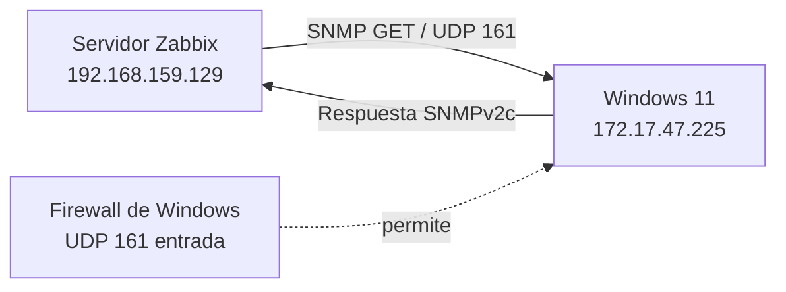


La dirección de la flecha es significativa: el servidor Zabbix origina la consulta hacia UDP/161 y Windows devuelve la respuesta. Por ello, la regla principal debe habilitar tráfico entrante en Windows; no es necesario abrir un puerto entrante adicional en el servidor para esta consulta.

## Requisitos previos

| Requisito | Verificación |
|---|---|
| Zabbix operativo | Servicios de base de datos, servidor y frontend activos |
| Acceso Linux | `root` o `sudo` en el servidor |
| Acceso Windows | PowerShell elevado y administrador local |
| Red | El servidor alcanza la IP de Windows |
| Descarga | Windows puede obtener la característica opcional SNMP |

## Paso 1 — Preparar el servidor Zabbix

Las utilidades de Net-SNMP permiten probar el agente de forma independiente antes de involucrar a Zabbix. Zabbix no necesita instalar `snmpwalk` para funcionar, pero sí requiere soporte SNMP en el proceso del servidor.

**CentOS/RHEL**

```bash
sudo dnf install -y net-snmp-utils
```

**Debian/Ubuntu**

```bash
sudo apt update
sudo apt install -y snmp
```

Compruebe el poller SNMP:

```bash
systemctl status zabbix-server --no-pager | grep -i "snmp poller"
```

Debe aparecer una línea similar a `snmp poller #1`. Si no aparece, revise que el binario de Zabbix tenga soporte SNMP.


## Paso 2 — Instalar SNMP en Windows

Abra **PowerShell → Ejecutar como administrador**. No basta con pertenecer al grupo de administradores si la consola no está elevada.

### 2.1 Consultar el identificador

```powershell
Get-WindowsCapability -Online -Name "SNMP*"
```

El estado esperado antes de instalar es `NotPresent`. Utilice el identificador exacto que devuelva su compilación.

### 2.2 Instalar y verificar

```powershell
$capability = Get-WindowsCapability -Online -Name "SNMP*" |
    Where-Object Name -like "SNMP.Client*" |
    Select-Object -First 1

if (-not $capability) {
    throw "No se encontró la característica SNMP.Client."
}

if ($capability.State -ne "Installed") {
    Add-WindowsCapability -Online -Name $capability.Name
}

Set-Service -Name SNMP -StartupType Automatic
Start-Service -Name SNMP
Get-Service SNMP | Select-Object Name, Status, StartType
```

La salida esperada es `Status: Running` y `StartType: Automatic`. Si Windows solicita reinicio, reinicie antes de continuar.

 

**Importante:** `SNMP` responde consultas; `SNMPTrap` recibe notificaciones asíncronas. No son el mismo servicio.

## Paso 3 — Configurar comunidad y agente

La configuración clásica del agente se realiza en `services.msc`, no en la aplicación moderna de Configuración.

1. Ejecute `services.msc`.
2. Abra las propiedades de **Servicio SNMP**.
3. En **Seguridad → Nombres de comunidad aceptados**, agregue `zbx_monitor` con derechos **SOLO LECTURA**.
4. Durante la validación inicial marque **Aceptar paquetes SNMP de cualquier host**.
5. En **Agente**, complete contacto y ubicación, y marque: **Físico**, **Aplicaciones**, **Vínculo de datos y subred**, **Internet** y **De extremo a extremo**.
6. Pulse **Aplicar → Aceptar** y reinicie el servicio.

```powershell
Restart-Service -Name SNMP
Get-Service -Name SNMP
```


**Criterio aplicado:** no use `public`; la comunidad es sensible a mayúsculas y minúsculas. Conceda solo lectura porque la monitorización no necesita modificar el sistema.

## Paso 4 — Verificar el firewall

Compruebe las reglas instaladas:

```powershell
Get-NetFirewallRule -DisplayName "*SNMP*" |
    Select-Object DisplayName, Enabled, Profile
```

Las reglas relevantes son las de **Servicio SNMP (UDP de entrada)**. Si no existe una regla activa para UDP/161, créela:

```powershell
New-NetFirewallRule `
    -DisplayName "SNMP-In-UDP161" `
    -Direction Inbound `
    -Protocol UDP `
    -LocalPort 161 `
    -Action Allow `
    -Profile Any
```


`-Profile Any` evita que una regla limitada al perfil Privado falle cuando Windows clasifica la red como Pública.

## Paso 5 — Validar con snmpwalk

Ejecute el comando en el **servidor Linux**, no en Windows:

```bash
snmpwalk -v2c -c zbx_monitor 172.17.47.225 .1.3.6.1.2.1.1
```

La respuesta debe incluir `sysDescr`, `sysName`, `sysUpTime` y `sysServices`. El valor `sysServices` suele ser `79` cuando están activados los cinco servicios del agente.


Si hay timeout, revise en este orden: servicio SNMP en ejecución; comunidad idéntica; opción temporal de aceptar cualquier host; regla UDP/161; conectividad y rutas.

## Paso 6 — Crear el equipo en Zabbix

En la interfaz web vaya a **Recopilación de datos → Equipos → Crear equipo**. No use **Monitorización → Equipos**, que es solo de consulta.

| Campo | Valor |
|---|---|
| Nombre de equipo | `Win11-SNMP` |
| Grupo | `Windows servers` |
| Plantilla | `Windows by SNMP` |
| Interfaz | `SNMP`, no `Agente` |
| IP/Puerto | `172.17.47.225:161` |
| Versión | `SNMPv2` |
| Comunidad | `{$SNMP_COMMUNITY}` |

En la pestaña **Macros** agregue:

| Macro | Valor |
|---|---|
| `{$SNMP_COMMUNITY}` | `zbx_monitor` |

Guarde el equipo y espere entre dos y tres minutos. El indicador SNMP debe quedar en verde. No seleccione **Windows by Zabbix agent**: utiliza un mecanismo diferente.

 

**Punto crítico:** si no define la macro, la plantilla puede heredar `public` y todos los elementos fallarán aunque `snmpwalk` funcione.

## Paso 7 — Restringir el acceso

Una vez confirmada la recolección, cierre la apertura temporal:

1. Vuelva a las propiedades de **Servicio SNMP → Seguridad**.
2. Seleccione **Aceptar paquetes SNMP de estos hosts**.
3. Agregue `192.168.159.129` (la IP real que ve Windows).
4. Aplique los cambios y reinicie:

```powershell
Restart-Service -Name SNMP
```

Valide de nuevo desde Linux:

```bash
snmpwalk -v2c -c zbx_monitor 172.17.47.225 .1.3.6.1.2.1.1
```


Si deja de responder, compruebe NAT o virtualización: la dirección de origen observada por Windows puede ser distinta de la IP lógica del servidor Zabbix.

## Diagnóstico

| Síntoma | Causa probable | Acción |
|---|---|---|
| `snmpwalk` expira | Servicio detenido, comunidad incorrecta o UDP/161 bloqueado | Revisar servicio, comunidad, firewall y ruta |
| `sysServices` no es 79 | Faltan servicios en la pestaña Agente | Marcar los cinco servicios y reiniciar SNMP |
| `snmpwalk` funciona pero Zabbix no | Macro ausente o plantilla equivocada | Definir `{$SNMP_COMMUNITY}` y usar `Windows by SNMP` |
| El estado queda gris | Interfaz SNMP incorrecta o equipo no disponible | Revisar IP, puerto, versión y conectividad |
| Funciona con cualquier host pero no restringido | IP de origen alterada por NAT | Autorizar la IP que realmente observa Windows |

## Lista de verificación

- [ ] `net-snmp-utils`/`snmp` instalado en el servidor.
- [ ] Poller SNMP visible en `zabbix-server`.
- [ ] Servicio Windows `SNMP` en ejecución y automático.
- [ ] Comunidad propia y con solo lectura.
- [ ] Cinco servicios del agente seleccionados.
- [ ] UDP/161 permitido en entrada.
- [ ] `snmpwalk` devuelve `sysName` y `sysUpTime`.
- [ ] Equipo creado con interfaz SNMP y plantilla correcta.
- [ ] Macro `{$SNMP_COMMUNITY}` definida.
- [ ] Acceso restringido a la IP real del servidor Zabbix.

## Alcance y privacidad

El monitoreo debe limitarse a métricas técnicas necesarias para el objetivo definido: disponibilidad, identidad del sistema, tiempo activo, interfaces y datos de inventario que la plantilla requiera. No deben recopilarse pulsaciones, contenido de archivos, capturas de pantalla, historial privado ni interpretaciones sobre la conducta de una persona.

Antes de publicar o compartir este repositorio, revise que no contenga comunidades reales, contraseñas, tokens, claves TLS/PSK, archivos `.env`, logs, nombres internos o direcciones privadas. Si una credencial del material original fue utilizada, debe revocarse y sustituirse.

## Referencias

La documentación de la instalación se basa en la configuración de SNMPv2c de Windows y en la plantilla oficial de Zabbix para dispositivos Windows. Consulte las fuentes oficiales antes de adaptar los comandos a otra versión del sistema operativo.

## Scripts y archivos del repositorio

- [`scripts/linux/install-snmp-tools.sh`](scripts/linux/install-snmp-tools.sh): instala herramientas y comprueba el poller.
- [`scripts/linux/test-snmp.sh`](scripts/linux/test-snmp.sh): ejecuta una prueba parametrizable.
- [`scripts/windows/install-snmp.ps1`](scripts/windows/install-snmp.ps1): instala e inicia la característica SNMP.
- [`scripts/windows/configure-snmp-firewall.ps1`](scripts/windows/configure-snmp-firewall.ps1): crea la regla UDP/161.
- [`config/variables.example.env`](config/variables.example.env): valores de ejemplo, sin secretos reales.
- [`docs/images/`](docs/images/): páginas visuales extraídas del documento fuente y asociadas a cada segmento.

## Licencia

Material de procedimiento preparado para uso interno y adaptación al entorno del repositorio. Revise las políticas de seguridad de su organización antes de utilizar SNMPv2c en producción.

## Fuente visual

La carpeta [`docs/source/`](docs/source/) conserva el PDF de referencia que se utilizó para mantener la distribución, el tono y la correspondencia de imágenes del procedimiento original.

